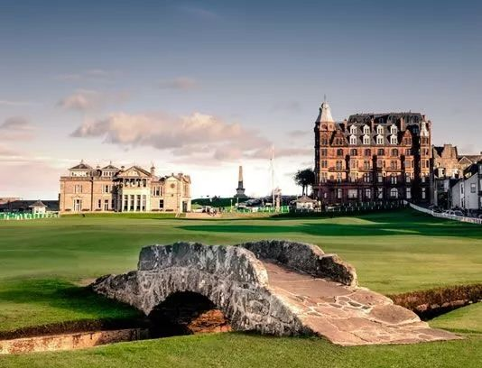

# 圣安德鲁斯老球场
> 世界上最古老的高尔夫球场

  

 

 

 圣安德鲁斯老球场（St Andrews Old Course），是世界上第一座高尔夫球场。它位于苏格兰东海岸法夫行政区，
 作为高尔夫运动的发源地，圣安德鲁斯在中世纪时期，还是苏格兰王国的宗教首都。 
 早在1400年前，这里的牧民就创造了一种游戏
 > 用果树枝制成的木杆，击打由皮革包裹的小球，目标是一定距离外预先指定好的小洞。

15世纪时，苏格兰人在圣安德鲁斯依照地形建立了一个高低起伏的球场，受制于细长的海岸地形，球场设立了11个球洞。1764年，部分球洞因被认为太短而遭到合并，球洞的数量自此由11减为9，于是形成为一轮比赛18洞的组合——成为后来兴建高尔夫球场的标准设计。

圣安德鲁斯老球场具有其独特的球场环境：112个天然沙坑, 包括著名的第14洞 “Hell”、 第11洞 “Strath” 以及超高难度的第17洞 “Road Hole”。因此，在圣安德鲁斯老球场完成一次18洞，为球手们带来的，是无限的愉悦与满足感。

这座小桥就是圣安德鲁斯的老球场的地标建筑——连接第17洞和第18洞的“Swilcan Bridge”，每一位高尔夫球手夺冠后都会走到桥上留影纪念。

600多年以来，圣安德鲁斯老球场始终是无数高球爱好者们顶礼膜拜的圣地“麦加”，在梦寐以求的老球场挥杆，就是他们的朝圣仪式。
 
